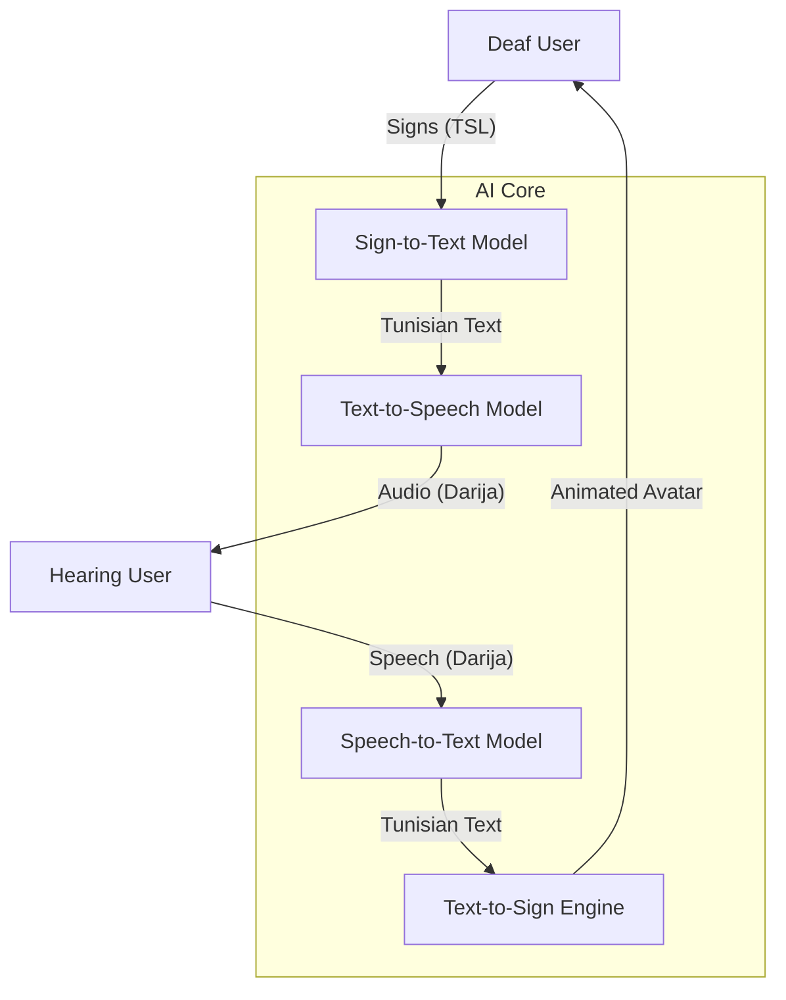

# 🇹🇳 SignBridge: Bridging the Gap in Tunisian Communication

[](https://www.python.org/)
[](https://streamlit.io/)
[](https://google.github.io/mediapipe/)
[](https://keras.io/)

**SignBridge** is a comprehensive accessibility platform designed to break communication barriers between the deaf and hearing communities in Tunisia. By leveraging state-of-the-art Deep Learning models, the platform provides seamless bidirectional translation between **Tunisian Dialect (Darija)** and **Tunisian Sign Language (TSL)**.

---

## 🚀 Project Vision
In Tunisia, the deaf community often faces significant hurdles due to the lack of specialized tools that understand the nuances of the local dialect and native sign language. TuniSign AI aims to provide a "Conversation Bridge" that is:
- **Culturally Aware**: Trained on Tunisian speech and sign datasets.
- **Real-time**: Capable of live sign recognition and instant speech synthesis.
- **Hyper-Visual**: Utilizing neon-skeleton avatars for better clarity and engagement.

---

## 🏗️ Technical Architecture



---

## 🧠 Core AI Modules

### 1. 🖐️ Sign to Text (SiTT)
- **Technology**: Mediapipe Hand Landmarking + Keras Temporal Attention Model.
- **Process**: Extracts 21 3D points per hand, normalizes coordinates relative to the wrist, and calculates inter-finger angles. A window-based model with an integrated attention mechanism classifies sequences of 16 frames into Tunisian signs.
- **[Deep Dive Into SiTT](./Tun_SiTT/)**

### 2. 🤟 Text to Sign (TTSi)
- **Technology**: Concatenative Synthesis + Mediapipe Holistic.
- **Process**: Looks up sign videos/frames from a curated TSL dataset. Extracts holistic landmarks (Pose + Hands) and renders them as a high-fidelity Neon Skeleton Avatar using an HTML5 Canvas engine.
- **[Deep Dive Into TTSi](./Tun_TTSi/)**

### 3. 🗣️ Text to Speech (Tun_TTS)
- **Technology**: Coqui XTTS v2 Fine-tuning.
- **Process**: Fine-tuned on the **TunArTTS** corpus (3 hours of diacritized Tunisian speech). It features a custom Tunisian normalizer that phonetically maps French loanwords to Arabic script for natural prosody.
- **[Deep Dive Into Tun_TTS](./Tun_TTS/)**

### 4. 🎧 Speech to Text (Tun_STT)
- **Technology**: OpenAI Whisper-small + Tunisian Bad-Word Filter.
- **Process**: Uses the Whisper-small model (244M parameters) for high-accuracy transcription of Tunisian Darija, leveraging its multilingual Transformer architecture trained on 680k hours of diverse audio. The transcribed output is then passed through a **profanity filter** built from a curated Tunisian bad-word dataset (`.xlsx`) for safe content delivery.
- **[Deep Dive Into Tun_STT](./Tun_STT/)**

---

## 💻 Streamlit Demo Suite

The project includes a multi-module Streamlit dashboard located in the `/Demo` directory:

1. **TTS Studio**: Advanced text-to-speech generation with sample Tunisian phrases.
2. **STT Workspace**: Upload or record audio for instant transcription.
3. **Sign Recognition**: Live webcam feed for real-time sign detection.
4. **Avatar Synthesis**: enter text (e.g., "3aslema") to see the neon avatar perform the sign.
5. **Conversation Bridge**: A unified interface for bidirectional interaction.

---

## 🛠️ Installation & Setup

> [!IMPORTANT]
> **Model Training Notebooks must be run on Google Colab.** The training pipelines for **STT**, **TTS**, and **SiTT** require at least **10 GB of VRAM** (GPU memory), and the necessary deep learning libraries come pre-installed in the Colab environment. The **TTSi** module does not require training — it runs directly as a Streamlit interface.

1. **Clone the repository**:
   ```bash
   git clone https://github.com/your-username/TuniSign-AI.git
   cd TuniSign-AI
   ```

2. **Train / export models** (on Google Colab):
   - Open each module's notebook (`Tun_STT/`, `Tun_TTS/`, `Tun_SiTT/`) in Colab and run all cells.
   - Download the resulting models and place them in the expected paths.

3. **Verify module-specific assets**:
   Ensure you have the following assets placed correctly:
   - `Demo/signtotext/tunisl_v4.keras` (Sign model — from SiTT notebook)
   - Whisper-small model (auto-downloaded on first run via `whisper.load_model("small")`)
   - `Demo/TextToSign/data/` (Avatar frame dataset — used directly by TTSi)

4. **Launch the platform**:
   ```bash
   cd Demo
   streamlit run app.py
   ```

---

## 🤝 Acknowledgments
- **TunArTTS Corpus**: For providing the foundation for Tunisian speech tasks.
- **Mediapipe**: For the robust landmark extraction framework.
- **Coqui-AI**: For the XTTS v2 architecture.

---
<p align="center">
  <i>Designed with ❤️ for the Tunisian Deaf Community.</i>
</p>
